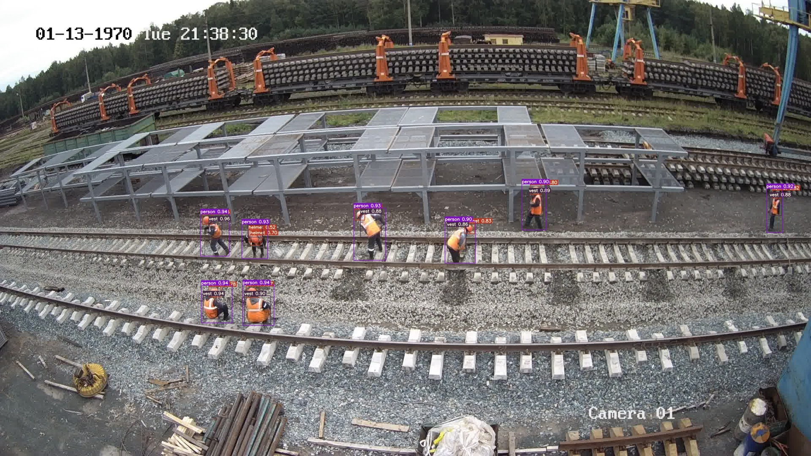
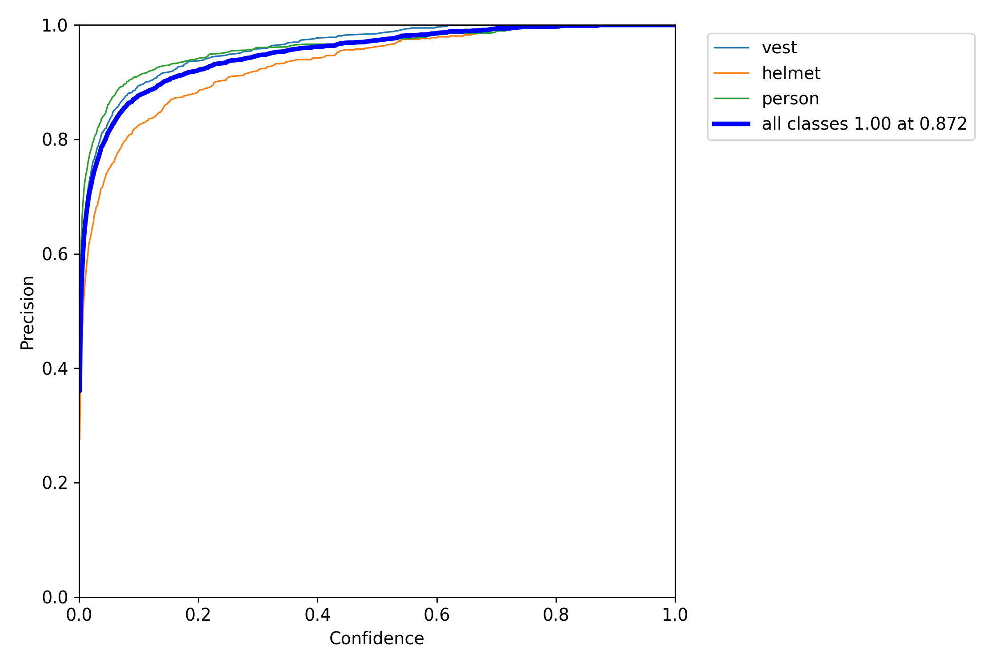
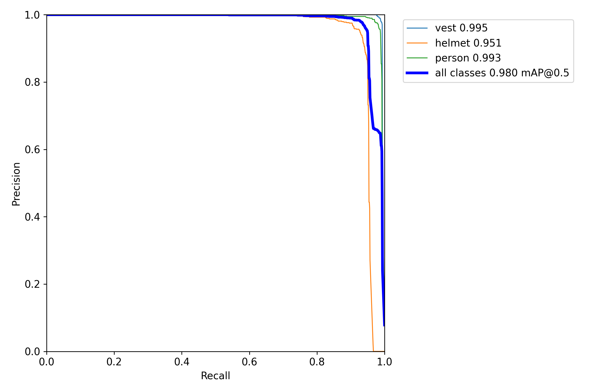
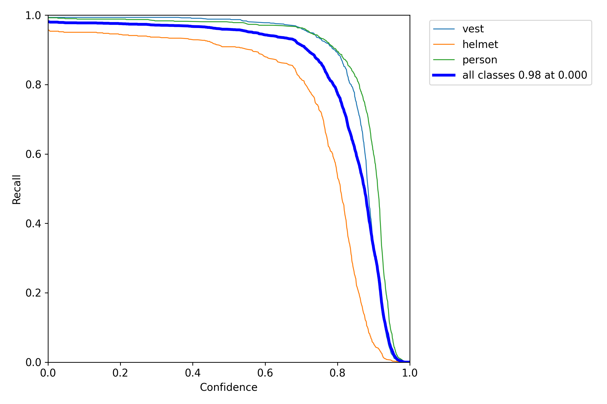
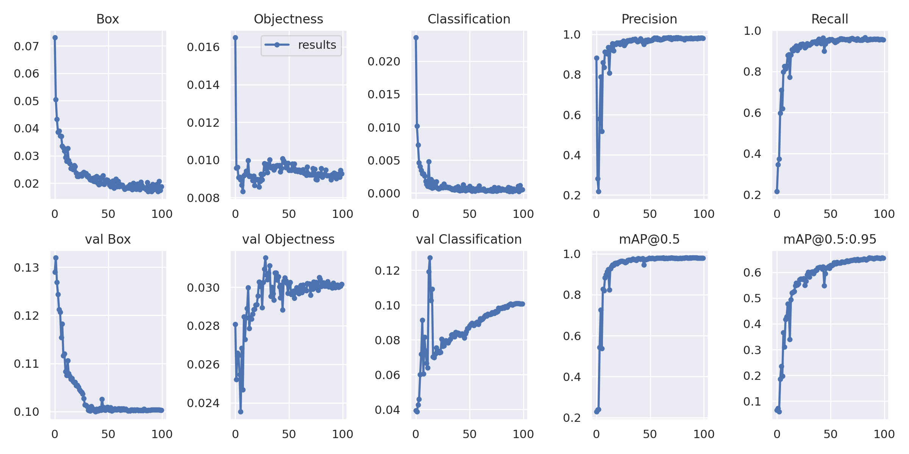
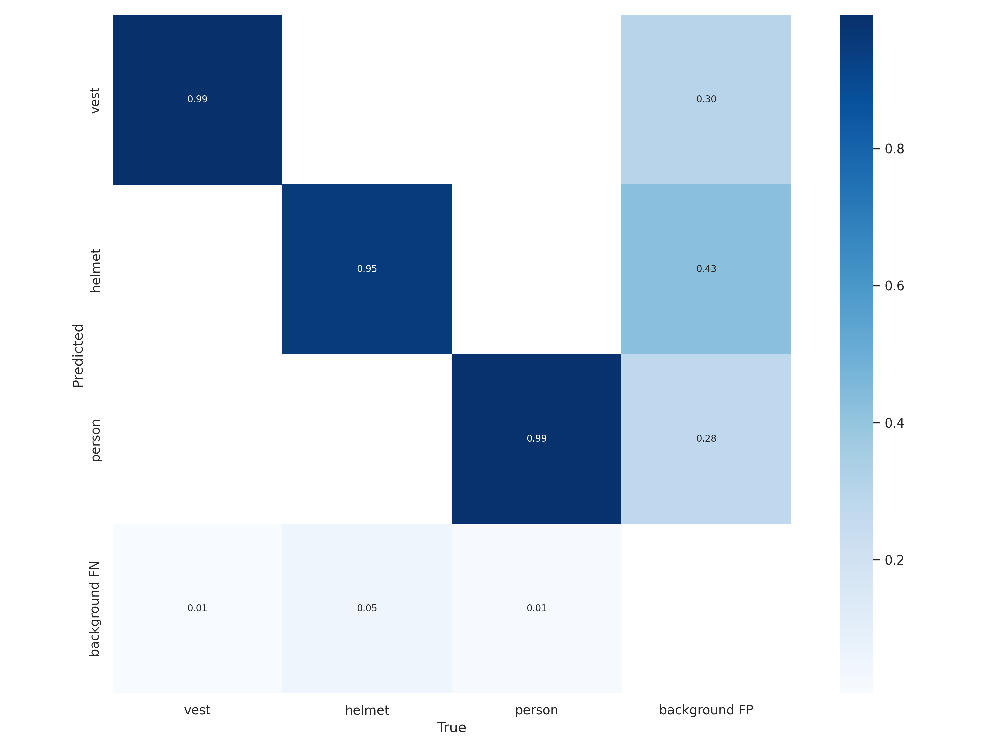

# Official YOLOv7

Implementation of paper - [YOLOv7: Trainable bag-of-freebies sets new state-of-the-art for real-time object detectors](https://arxiv.org/abs/2207.02696)

## Performance 

| Model | Test Size | AP<sub>50</sub><sup>test</sup> | batch 1 fps | batch 32 average time |
| :-- | :-: | :-: | :-: | :-: |
| [**YOLOv7-Tiny**](https://github.com/akanametov/yolov7/releases/download/1.0/yolov7-tiny-builder.pt) | 640 | **98.7%** | 417 *fps* | 2.4 *ms* |

## Installation

Docker environment (recommended)
<details><summary> <b>Expand</b> </summary>

``` shell
# create the docker container, you can change the share memory size if you have more.
nvidia-docker run --name yolov7 -it -v your_coco_path/:/coco/ -v your_code_path/:/yolov7 --shm-size=64g nvcr.io/nvidia/pytorch:21.08-py3

# apt install required packages
apt update
apt install -y zip htop screen libgl1-mesa-glx

# pip install required packages
pip install seaborn thop

# go to code folder
cd /yolov7
```

</details>

## Testing

[`yolov7-tiny-builder.pt`](https://github.com/akanametov/yolov7/releases/download/1.0/yolov7-tiny-builder.pt)

``` shell
python test.py --data data/builder.yaml --img 640 --batch 32 --conf 0.001 --iou 0.5 --device 0 --weights yolov7-tiny-builder.pt --name yolov7_tiny_builder_val
```

You will get the results:

```
   Class      Images      Labels           P           R      mAP@.5  mAP@.5:.95
     all         200        1376       0.985       0.969       0.987       0.679
    vest         200         486        0.98       0.986       0.997       0.707
  helmet         200         404       0.992       0.928       0.968       0.573
  person         200         486       0.984       0.994       0.997       0.757
```

## Inference

On image:
``` shell
python detect.py --weights yolov7-tiny-builder.pt --conf 0.25 --img-size 640 --source inference/images/builder/1779.jpg
```

<div align="center">
    <a href="./">
        
    </a>
</div>

## Results

PR curve:
<div align="center">
    <a href="./">
        
    </a>
    <a href="./">
        
    </a>
    <a href="./">
        
    </a>
</div>

Losses and mAP:
<div align="center">
    <a href="./">
        
    </a>
</div>

Confusion matrix:
<div align="center">
    <a href="./">
        
    </a>
</div>

## Training

Data preparation

``` shell
bash scripts/get_dataset.sh
```

* Download [dataset](https://drive.google.com/file/d/1BKMXnyPFT6uFWCSbyrZ7r5st9bCQwb2T/view?usp=sharing) and pretrained [yolov7-tiny.pt](https://github.com/WongKinYiu/yolov7/releases/download/v0.1/yolov7-tiny.pt)

Single GPU training

``` shell
# train tiny model
python train.py --epochs 100 --workers 4 --device 0 --batch-size 32 --data data/builder.yaml --img 640 640 --cfg cfg/training/yolov7-tiny-builder.yaml --weights 'yolov7-tiny.pt' --name yolov7_tiny_builder --hyp data/hyp.scratch.tiny.yaml
```

## Transfer learning

[`yolov7-tiny.pt`](https://github.com/WongKinYiu/yolov7/releases/download/v0.1/yolov7-tiny.pt)

## Citation

```
@article{wang2022yolov7,
  title={{YOLOv7}: Trainable bag-of-freebies sets new state-of-the-art for real-time object detectors},
  author={Wang, Chien-Yao and Bochkovskiy, Alexey and Liao, Hong-Yuan Mark},
  journal={arXiv preprint arXiv:2207.02696},
  year={2022}
}
```

## Acknowledgements

<details><summary> <b>Expand</b> </summary>

* [https://github.com/AlexeyAB/darknet](https://github.com/AlexeyAB/darknet)
* [https://github.com/WongKinYiu/yolor](https://github.com/WongKinYiu/yolor)
* [https://github.com/WongKinYiu/PyTorch_YOLOv4](https://github.com/WongKinYiu/PyTorch_YOLOv4)
* [https://github.com/WongKinYiu/ScaledYOLOv4](https://github.com/WongKinYiu/ScaledYOLOv4)
* [https://github.com/Megvii-BaseDetection/YOLOX](https://github.com/Megvii-BaseDetection/YOLOX)
* [https://github.com/ultralytics/yolov3](https://github.com/ultralytics/yolov3)
* [https://github.com/ultralytics/yolov5](https://github.com/ultralytics/yolov5)
* [https://github.com/DingXiaoH/RepVGG](https://github.com/DingXiaoH/RepVGG)
* [https://github.com/JUGGHM/OREPA_CVPR2022](https://github.com/JUGGHM/OREPA_CVPR2022)
* [https://github.com/TexasInstruments/edgeai-yolov5/tree/yolo-pose](https://github.com/TexasInstruments/edgeai-yolov5/tree/yolo-pose)

</details>
